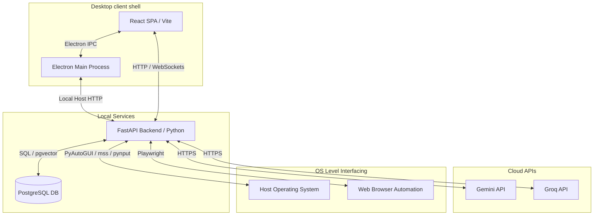

# Architecture Document — Atlas

This document outlines the multi-process system architecture of Atlas. It explains how the Frontend, Desktop Shell, Backend Service, and Database interact securely and efficiently.

---

## 1. System Topology

Atlas is split into three main processes to separate the user interface, desktop management, and heavy automation logic:

---

## 2. Process Responsibilities

### 2.1 UI Renderer (React + Vite)
- **Role**: Presentation layer.
- **Tech Stack**: TSX, TailwindCSS, Framer Motion, shadcn/ui.
- **Access**: Sandboxed. It cannot access Node.js or Python directly. It communicates exclusively through the Electron `preload` bridge and local FastAPI endpoints.

### 2.2 Desktop Shell (Electron Main)
- **Role**: Native Windows shell wrapper.
- **Tech Stack**: Electron, TypeScript.
- **Access**: Full Node.js system access.
- **Responsibilities**:
  - Spawning and managing the FastAPI Python background process.
  - Managing application windows, tray icons, global shortcut bindings (e.g., `Alt + Space` to summon Atlas).
  - Proxying system notifications and OS privileges requests.

### 2.3 Local Backend Service (FastAPI)
- **Role**: Heavy-lifting service engine.
- **Tech Stack**: Python 3.10+, FastAPI, SQLAlchemy, Uvicorn.
- **Access**: Host OS access (file system, mouse, keyboard, screenshots).
- **Responsibilities**:
  - LLM orchestration (integrating Gemini and Groq APIs).
  - Local database connectivity to PostgreSQL.
  - Automation scripts execution (Playwright for web automation; PyAutoGUI, pynput, and mss for OS operations).

---

## 3. Communication Protocols

| Channel | Source | Destination | Protocol | Purpose |
| :--- | :--- | :--- | :--- | :--- |
| **Electron IPC** | React Renderer | Electron Main | Preload ContextBridge | Querying window states, native notifications, registration of global keybindings. |
| **Local REST** | React / Electron | FastAPI | HTTP | Fetching configurations, retrieving chat history, posting API configurations. |
| **WebSocket** | React Renderer | FastAPI | WS (ws://localhost:8000) | Stream LLM tokens, stream microphone audio bytes, or push real-time automation updates. |
| **Database Connection**| FastAPI | PostgreSQL | TCP/IP (psycopg2) | Storing and querying conversational logs, user profiles, metadata indices. |

---

## 4. Bootstrapping Sequence

1. The user launches the `Atlas` executable.
2. The **Electron Main** process initializes and checks if the local **FastAPI Backend** is already running. If not, it spawns it as a child process (referencing Python executable in `backend/venv` during dev or packaged binary in production).
3. **Electron Main** monitors the backend's `/health` endpoint until a `200 OK` is returned.
4. **Electron Main** spawns the React Browser Window, loading `http://localhost:5173` (dev) or the local `index.html` static build (production).
5. The application UI becomes interactive, connects to the FastAPI WebSocket server, and establishes stable operation.
